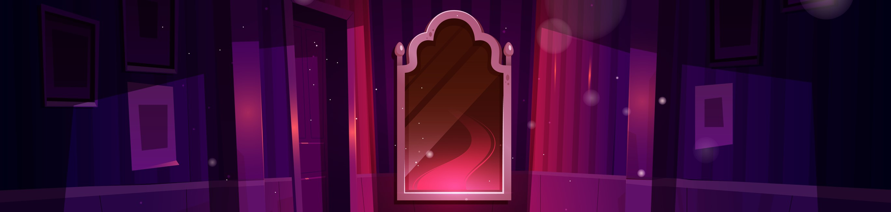

# Mirror, mirror on the wall... Am I a critical thinker after all?

## Abstract

How many times have you looked back at a project only to find a mix of technologies, architectural styles, patterns, and practices that somehow just don’t fit together, only to conclude: This is unmaintainable... Let's rewrite the whole thing! As tech professionals, we usually pride ourselves in our ability to think critically because, as part of our work, we continuously tackle complex problems. But are we really critical thinkers? If so, which decisions led to this point? Were they made consciously? What decision framework was used to structure our thoughts and avoid biases?

Over the last years of my career, I have applied practices to decision-making that have significantly improved my decision-making and how I evaluate and challenge decisions made by others. In this session, I'll share the essential building blocks that improve critical thinking, help break through biases, and improve our intent and communication when making impactful decisions. You'll learn to apply tactics to help identify assumptions, evaluate options objectively, and assess risk. You'll walk out of this session with actionable takeaways that will help strengthen your decisions in our complex and ever-changing technology landscape.

## Is there a recording?

A recording of this talk from NDC Porto is available [on their YouTube channel](https://youtu.be/fxB2aMKcZDw?si=u-Ke1DbZ1lhbmJjW).

## Additional information

Make sure to check the additional [resources](resources) for this topic.
