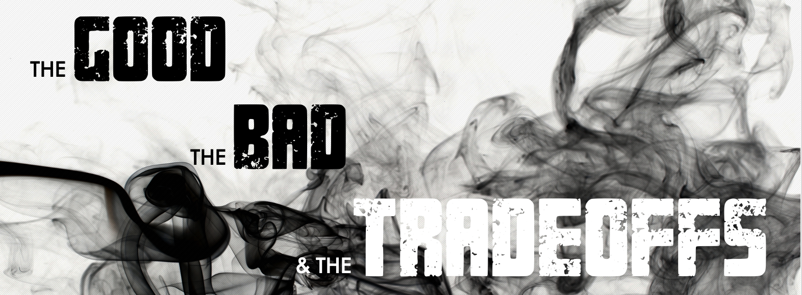

# Orchestration vs. Choreography: The good, the bad, and the trade-offs

## Abstract

One of the goals of building microservice-based architectures is to reduce the complexity of individual components. In doing so, much of that complexity shifts from individual services towards interservice communication, making how we design those service interactions essential in our system design. That's where orchestration and choreography come in, two coordination techniques that can help us design complex workflows in our system. While the web offers numerous articles that carefully outline the pros and cons of each pattern, the real challenge is left to the reader: deciphering which pattern best fits your specific use case by understanding which arguments apply to your use case and weighing only the relevant ones in your decision.

In this session, we’ll thoroughly examine each pattern with practical examples from the banking business, based on almost five years of experience in this domain. By thoroughly understanding the tradeoffs of each approach and understanding the right questions to ask, we can build a mental framework that helps us make well-balanced decisions about which pattern to use. Join me in this session, where we’ll transform the abstract concepts of orchestration and choreography into a tangible decision-making framework that steers you in the right direction!

## Is there a recording?

A recording of this talk at [NDC Porto](https://ndcporto.com/) is [available on YouTube](https://www.youtube.com/watch?v=p8NTe7NFhH8).
