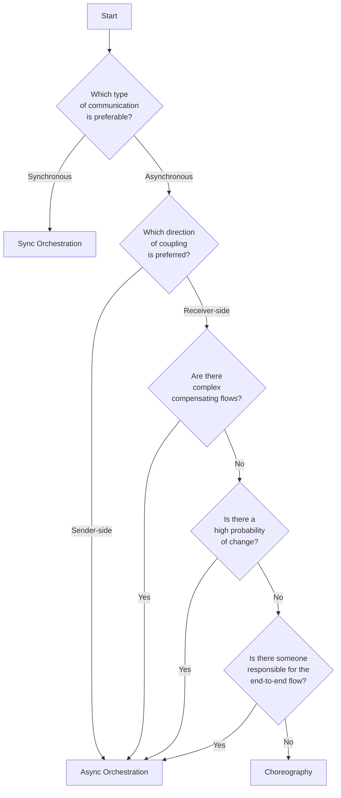

# The 5-question decision-framework

I developed this framework for myself over the years. It is based on learnings from the field and the [books listed in the resources](/README.MD#books).

The five main questions to keep in mind are:
1. What type of communication is suitable? Synchronous or asynchronous communication?
2. Which direction of coupling is preferred? Does it make sens to couple the sender to the receiver, or the receiver to publisher?
3. Are there complex compensating flows? Would they introduce significant bidirectional coupling?
4. Is there a high probability of change?
5. Is there someone responsible for the end-to-end flow? This is where it's also important to reassess the scope of the workflow and whether some parts can be isolated into dedicated workflows.

The flowchart below provides an overview of the decision-making process. It's important to note that this is a simplification, and sufficient questioning and analysis should happen in each diamond block.

Don't forget to draw each your workflow using both styles, as it can be useful to use a visual representation to consider hidden requirements, the impact of change, and so forth.
