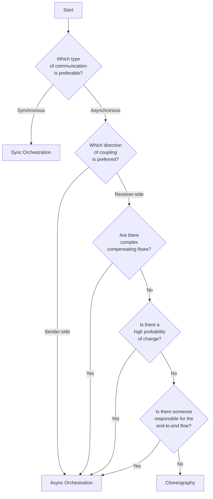

# The 5-question decision-framework

I developed this framework for myself over the years. It is based on learnings from the field and the [books listed in the resources](/README.MD#books).
This framework consists of five pillar questions to ask yourself, but of course it's important to dig further into the details of each pillar.

The five main questions to keep in mind are:
1. What type of communication is suitable? Synchronous or asynchronous communication?
  - Are there business requirements that require synchronous communication?
  - Is it acceptable for errors to occur, and in the worst case, for requests to be lost? Is the contrary true?
  - Are there scaling requirements that may affect this decision?
2. Which direction of coupling is preferred? Does it make sens to couple the sender to the receiver, or the receiver to publisher?
  - Does it make sense for the sender to be coupled to the receiver, and introduce command coupling?
  - Is it more suitable to decouple sender from receiver, and instead rely on the inverse coupling?
3. Are there complex compensating flows? Would they introduce significant bidirectional coupling?
  - How many compensation flows are there in this business process?
  - How extensive are they? Which services do they impact?
  - How many "hops back" does it require to complete a compensating flow? How much bidirectional coupling does this introduce?
4. Is there a high probability of change?
  - Are you working on a relatively stable domain? Or is change on the horizon?
  - What are some of the most plausible changes that may need to be implemented here?
  - How would these affect your current design?
5. Is there someone responsible for the end-to-end flow?
  - If a workflow is stuck, who would be responsible to "unstuck" it?
  - Who would be responsible/accountable for the flow?
  - Are there parts of the workflow where there's high responsibility involved that could be isolated?

Finally, keep in mind that it's important to continuously reassess the scope of the workflow and question whether some parts can be isolated into dedicated workflows.
Too large workflows may repeatedly guide you towards an orchestrated approach as you require more control. Therefore, this is an essential part of the equation.

The flowchart below provides an overview of the decision-making process. It's important to note that this is a simplification, and sufficient questioning and analysis should happen in each diamond block.

Don't forget to draw each your workflow using both styles, as it can be useful to use a visual representation to consider hidden requirements, the impact of change, and so forth.
