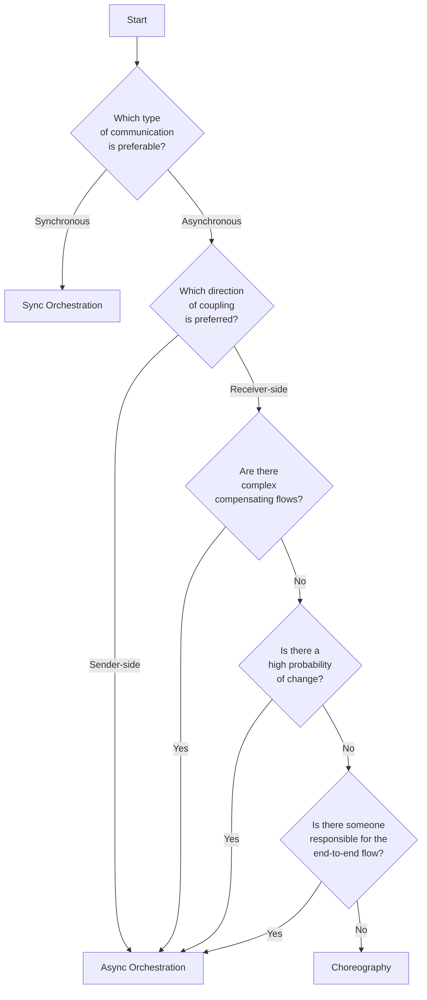

# Resources

Here, you can find a list of resources to further your understanding of these topics. I keep this list up to date with new resources I come across. If you can think of valuable additions, feel free to contribute!

### The 5-question decision-framework

This framework I developed for myself, and I've found useful over the years. It is based on learnings from the field and the books listed in the section below.

The flowchart below provides an overview of the decision-making process. It's important to note that this is a simplification, and sufficient questioning and analysis should happen in each diamond block. One main consideration to always keep in mind is the size of the workflow. If there are sub workflows that can be isolated, the exercise should be repeated for each individual workflow.

Don't forget to draw each your workflow using both styles, as it can be useful to use a visual representation to consider hidden requirements, the impact of change, and so forth.

### Books

The following books cover the topics orchestration and choreography. They're listed in order of relevance:

- [Software Architecture: The hard parts ](https://www.oreilly.com/library/view/software-architecture-the/9781492086888/), by Neal Ford, Mark Richards, Pramod Sadalage, Zhamak Dehghani
- [Practical Process Automation](https://www.oreilly.com/library/view/practical-process-automation/9781492061441/), by Bernd Ruecker
- [Building Microservices: Designing Fine-Grained Systems](https://www.oreilly.com/library/view/building-microservices-designing/9781663728203/), by Sam Newman, Theodore O'Brien

